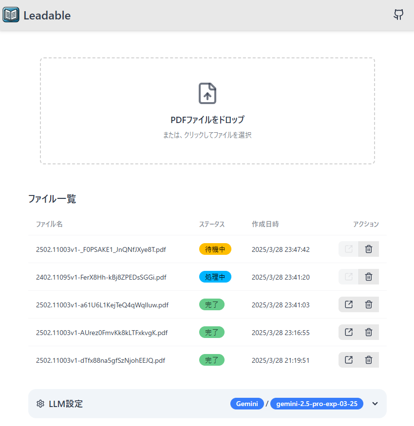

# Leadable

論文向けPDF翻訳サービス「[Index_PDF_Translation](https://github.com/Mega-Gorilla/Index_PDF_Translation)」の[フォーク](https://github.com/chitsii/Index_PDF_Translation)をフォークし、ローカル環境の大規模言語モデルを利用して翻訳するように変更したものです。
英日翻訳にのみ対応。

## 使い方

1. 翻訳したいPDFをエリアにドロップ or クリックでファイルダイアログから選択
   

2. `PDFを翻訳` ボタンを押して翻訳を実行する
   

3. 翻訳が完了したら `ダウンロード` のボタンが現れる。また履歴に追加される  
   

## LLM設定

1. プロバイダーとモデルを選択して使用することができます。
   

2. モデル選択欄は検索バーも兼ねています。  
   

3. プロバイダーが `Ollama` の場合のみモデルを追加することができます。
   
> [!WARNING]
> Ollama もしくは HuggingFaceにモデルがある場合のみ  
> モデルサイズが大きいためダウンロードに時間がかかります。時間をおいて使用してください  

## 立ち上げ

`.evn.example` を参考に `.env` を作成してください。  

```sh
make up
```

以下立ち上がるサイト

- [Leadable](http://localhost:8877) - メインアプリケーション
- [Open WebUI](http://localhost:8778) - Ollamaとのチャット用
- [Ollama Model Manager](http://localhost:8788) - Ollama用のモデル管理
